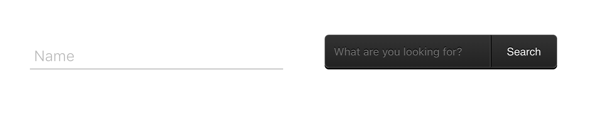

<div align="center">
 <h1>iwant-style</h1>

Import ready styles using CSS in JS to be used in conjunction with stylized components.

[](https://github.com/mariorodeghiero/iwant-style/issues)
<a href="https://badge.fury.io/js/iwant-style"></a>
[](https://github.com/mariorodeghiero/iwant-style/issues?q=is%3Aopen+is%3Aissue+label%3Afeature-request+sort%3Areactions-%2B1-desc)
[](https://github.com/mariorodeghiero/iwant-style/issues?utf8=✓&q=is%3Aissue+is%3Aopen+label%3Abug)
[](http://npm-stat.com/charts.html?package=iwant-style)
[](http://opensource.org/licenses/MIT)


</div>

## Contents

- [Getting Started](#getting-started)
- [Usage](#usage)
- [Components](#components)

  - [Preloader](#Preloader)
  - [Avatar](#Avatar)
  - [Button](#Button)
  - [Input](#Input)
  - [Card](#Card)
  - [Pagination](#Pagination)
  - [Navbar](#Navbar)
  - [Background](#Backgound)

- [How to Contribute](#Contributors)

## Getting Start

```bash
npm install iwant-style
```

```bash
npm install styled-components
```

## Usage

```javascript
  import styled from 'styled-components';

  import { inputDark } from 'iwant-style';

  const Dark = styled.form`
    ${inputDark};
  `;

  ...
     <Dark action='' method=''>
      <input type='search' placeholder='What are you looking for?' />
      <button>Search</button>
    </Dark>
  ...
```

## Components

### PreLoader


##### Usage

```javascript
  import styled from 'styled-components';

  import { preloader } from 'iwant-style';

  const Preloader = styled.div`
    ${preloader};
  `;

  ...
    <Preloader>
        <div />
        <div />
        <div />
    </Preloader>
  ...
```

##### Properties

| Name                 | Parameter | Default   |
| -------------------- | --------- | --------- |
| `${preloader}`       |           | `bubbles` |
| `${preloaderCircle}` |           | `circle`  |

## Preloader Circle

```javascript
  import styled from 'styled-components';

  import { preloaderCircle } from 'iwant-style';


  const Preloader = styled.div`
    ${preloaderCircle};
  `;

  ...
    <Preloader>
        <div />
    </Preloader>
  ...
```

### Avatar


##### Usage

```javascript
  import styled from 'styled-components';

  import { avatar } from 'iwant-style';

  const Avatar = styled.img`
    ${avatar};
  `;

  ...
    <Avatar src='https://s3-us-west-2.amazonaws.com/s.cdpn.io/331810/profile-sample9.jpg' />
  ...
```

##### Properties

| Name        | Parameter | Default  |
| ----------- | --------- | -------- |
| `${avatar}` |           | `person` |

### Button


##### Usage

```javascript
  import styled from 'styled-components';

  import { btn } from 'iwant-style';

  const Button = styled.button`
    ${btn};
  `;

  ...
    <Button>Start</Button>
  ...
```

##### Properties

| Name            | Parameter   | Default  |
| --------------- | ----------- | -------- |
| `${btn}`        |             | `square` |
| `${btn(param)}` | `"disable"` |          |
| `${btn(param)}` | `"float"`   |          |

### Input



##### Usage

```javascript
  import styled from 'styled-components';

  import { input } from 'iwant-style';

  const Input = styled.div`
    ${input};
  `;

  ...
     <Input>
      <input type='text' required />
      <span />
      <label>Name</label>
    </Input>
  ...
```

## Dark

```javascript
  import styled from 'styled-components';

  import { inputDark } from 'iwant-style';

  const Dark = styled.form`
    ${inputDark};
  `;

  ...
     <Dark action='' method=''>
      <input type='search' placeholder='What are you looking for?' />
      <button>Search</button>
    </Dark>
  ...
```

##### Properties

| Name       | Parameter | Default     |
| ---------- | --------- | ----------- |
| `${input}` |           | `animation` |

### Card


##### Usage

```javascript
  import styled from 'styled-components';

  import { card } from 'iwant-style';

  const Card = styled.div`
    ${card};
  `;

  ...
     <Card>
       <h1>Card Title</h1>
        <p>
          Veniam elit commodo culpa sunt adincididunt nisi minim amet qui
          sit pariatur occaecat. Veniam elitcommodo culpa sunt ad
          incididunt nisi minim amet qui sitpariatur occaecat. sit pariatur
          occaecat.
        </p>
      <hr />
      <div>
        <a href='#'>This is a link</a>
        <a href='#'>This is a link</a>
      </div>
     </Card>
  ...
```

##### Properties

| Name      | Parameter | Default |
| --------- | --------- | ------- |
| `${card}` |           | `info`  |

### Pagination


##### Usage

```javascript
  import styled from 'styled-components';

  import { pagination } from 'iwant-style';

  const Pagination = styled.ul`
    ${pagination};
  `;

  ...
     <Pagination>
            <li>
              <a href='#'>&lt;</a>
            </li>
            <li>
              <a href='#'>1</a>
            </li>
            <li>
              <a href='#'>2</a>
            </li>
            <li>
              <a href='#'>3</a>
            </li>
            <li>
              <a href='#'>&gt;</a>
            </li>
    </Pagination>
  ...
```

##### Properties

| Name            | Parameter | Default |
| --------------- | --------- | ------- |
| `${pagination}` |           | `arrow` |

## Contributing

Please read [CONTRIBUTING.md](CONTRIBUTING.md) for details on our code of conduct, and the process for submitting pull requests to us.

## Author

- [Mário Antônio do Amaral Rodeghiero](https://github.com/mariorodeghiero)

## Contributors

| [](https://github.com/mariorodeghiero) |
| --------------------------------------------------------------------------------------------------------------------- |


| [Mário Rodeghiero](https://github.com/mariorodeghiero)

## License

This project is licensed under the MIT License - see the [LICENSE.md](LICENSE.md) file for details
